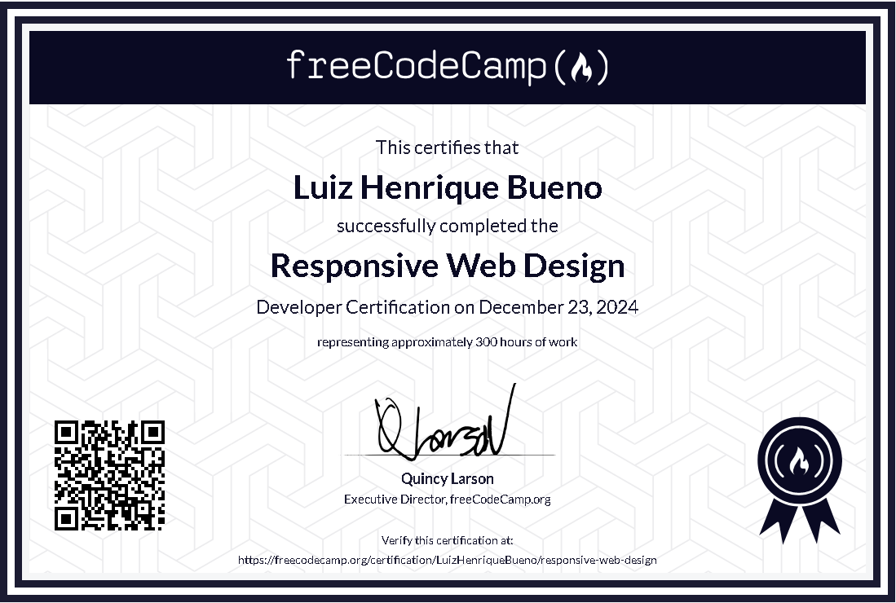

# Responsive Web Design

Welcome to the **Responsive Web Design** repository! This repository showcases the projects I completed as part of the **Responsive Web Design** certification offered by [freeCodeCamp](https://www.freecodecamp.org/).

---

## Overview
The **Responsive Web Design** certification was a foundational step in my web development journey. It covered essential topics such as:

- **HTML Fundamentals**
- **CSS Styling Techniques**
- **Principles of Responsive Design**
- **Building Accessible and User-Friendly Web Pages**

Through hands-on projects, I solidified my understanding and practical application of these concepts.

---

## Projects
Here are the projects included in this repository:

1. **Tribute Page**
   - A simple, responsive page dedicated to a subject of choice.

2. **Survey Form**
   - An interactive and accessible survey form.

3. **Product Landing Page**
   - A responsive landing page with design elements and call-to-action sections.

4. **Technical Documentation Page**
   - A multi-section technical documentation page with smooth navigation.

5. **Personal Portfolio Webpage**
   - A personal portfolio showcasing skills and projects.

---

## Technologies Used

- **HTML5**: Markup language for structuring content.
- **CSS3**: Stylesheets for layout and design.
- **Responsive Design Techniques**: Media queries, flexbox, and grid.

---

Thank you for visiting! 😄
